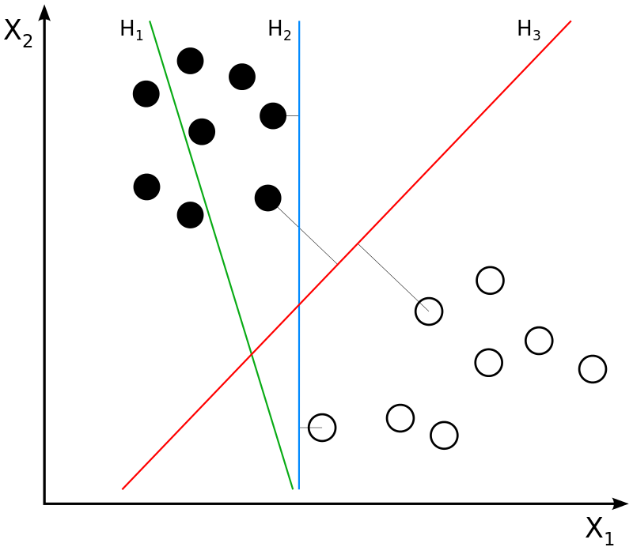

```{r setup, include=FALSE}
knitr::opts_chunk$set(cache=TRUE,
                      echo = TRUE,
                      warning = FALSE,
                      message = FALSE)
```

# Introduction

Day 1 of NBA free agency is by far the biggest day of the offseason for the league. It was a doozy last season, with [seismic shifts in the league's power structure](https://wwos.nine.com.au/basketball/nba-season-preview-ben-simmons-philadelphia-76ers-chance-to-impact-title-race/431d007a-614f-4fce-8d55-29d73d79659a). Arguably 2 of the top 5 players (when healthy) in the league, as well as an additional 3 within the top 25, changed teams.

This year's class? Not as highly regarded as last year. Anthony Davis is the crown jewel, while Brandon Ingram is the best restricted free agent available. The hype of this class was further deflated when players like 
[Kyle Lowry](https://www.nba.com/article/2019/10/07/report-kyle-lowry-contract-extension) and 
[Draymond Green](https://www.espn.com/nba/story/_/id/27314349/green-warriors-reach-4-year-100m-extension) signed extensions with their current teams.

What I wanted to do was predict what contracts this year's free agent class might get based off previous offseasons. Stars generally get star-type money, but in tiers below, contracts of comparable players usually come up in discussing contract value.

# Methods/Analysis

## Loading Packages

Let's start by loading required packages.
```{r load_pkgs, results="hide"}
if(!require(tidyverse)) 
  install.packages("tidyverse", repos = "http://cran.us.r-project.org")
if(!require(caret)) 
  install.packages("caret", repos = "http://cran.us.r-project.org")
#Rborist and ranger are random forest algorithm wrappers
if(!require(Rborist)) 
  install.packages("Rborist", repos = "http://cran.us.r-project.org")
if(!require(ranger)) 
  install.packages("ranger", repos = "http://cran.us.r-project.org")
#zoo allows rolling operations
if(!require(zoo))
  install.packages("zoo", repos = "http://cran.us.r-project.org")
#matrix stats
if(!require(matrixStats)) 
  install.packages("matrixStats", repos = "http://cran.us.r-project.org")
#rpart.plot shows the decision tree of an rpart result
if(!require(rpart.plot)) 
  install.packages("rpart.plot", repos = "http://cran.us.r-project.org")
#kableExtra allows more customization of tables
if(!require(kableExtra)) 
  install.packages("kableExtra")
if(!require(RColorBrewer)) 
  install.packages("RColorBrewer", repos = "http://cran.us.r-project.org")
#for dark background plots
if(!require(ggdark)) 
  install.packages("ggdark", repos = "http://cran.us.r-project.org")
```

## Importing the Data

There are five files I'll import.
```{r load_stats}
advanced<-read_csv("Advanced.csv") %>% 
  mutate(tm=ifelse(tm=="TOT","1TOT",tm)) %>% 
  group_by(player_id,season) %>% arrange(tm) %>% slice(1) %>% 
  mutate(tm=ifelse(tm=="1TOT","TOT",tm)) %>% select(seas_id:mp,ows:ws,vorp)
totals<-read_csv("Player Totals.csv") %>% 
  mutate(tm=ifelse(tm=="TOT","1TOT",tm)) %>% 
  group_by(player_id,season) %>% arrange(tm) %>% slice(1) %>% 
  mutate(tm=ifelse(tm=="1TOT","TOT",tm))
advanced_and_totals<-inner_join(totals,advanced)
```
For the statistical data, I've scraped total and advanced stats from Basketball-Reference and placed them in .csv files. The advanced stats I kept were cumulative (offensive win shares, defensive win shares and value over replacement player). This was actually part of a larger project to scrape complete statistics for teams, players and awards from 1947-2019. To my knowledge, my dataset is unique in that it includes BAA stats and ABA stats. For players who played on multiple teams in one season, I kept their total stats and discarded the team-specific season portions.
```{r load_train}
free_agents<-read_csv("2016-2019 Free Agents.csv")
```
For training data, I initially wanted to take free agents from the season 2013 onwards, because that was the start of consecutive salary cap increases. However, due to the easy accessibility of Basketball-Reference's free agent tracker, I decided to use free agents from 2016-2019. This would only include players who signed during offseasons (no in season signings).

* removed retired players and players who signed from overseas (wouldn't have any contract year data) from the dataset
* set contract years to zero and salary to zero for around 250 players who:
    + went overseas
    + had explicitly non guaranteed first years in their contracts (training camp deals, two ways, ten days, exhibit 10s)
    + had blanks in their contract terms cell
* included option years and partially guaranteed years in my calculation of contract years
    + looked at it as both sides (player and team) intending to see out the contract
* gathered salaries for remaining 400 or so players:
    + decision to make between using year 1 cap hit or year 1 salary, but decision was made for me based off  websites used to gather the data ([Capology](https://www.capology.com), [Spotrac](https://www.spotrac.com/nba/contracts/) and [Basketball-Insiders](http://www.basketballinsiders.com/nba-team-salaries-at-a-glance/))
        - Capology = main source, but inconsistent with min/near-min contracts
        - Spotrac requires a premium login to view contract cap hits beyond the last and current contracts, but the cash earnings are free to view
        - When player was near-minimum & played for multiple teams in one season, Basketball-Insiders had transaction history in team salary archives (needed player's first team of season)
* fixed some small errors
    + Nikola Jokic was an RFA, not a UFA when he signed his 5-year extension
    + Alex Len accepted the qualifying offer rather than no contract
* added suffixes (Jr., II, III) to certain players to match up with statistical data

\newpage
```{r load_eval}
fa_2020<-read_csv("Free Agents 2020.csv")
#separate out options to compare what players options get if declined
fa_2020_options<-fa_2020 %>% filter(str_detect(type,"PO|CO"))
#remove club options (unsure how to handle), make player options all declined (UFA's)
fa_2020<-fa_2020 %>% filter(type != "CO") %>% 
  mutate(type=ifelse(type=="PO","UFA",type)) %>% group_by(player) %>% slice(1)
```
Our evaluation set is the 2020 free agent class which I got off Spotrac. I had to edit it to match the Basketball-Reference names (mainly adding diacritics to European names). In addition, I filtered out players with options. I'm unsure how to handle club options, but players who decline player options become unrestricted free agents. I'll use this fact to see which players might decline their option. Instead of first year percent of cap, I listed the actual monetary salary (taken from Spotrac) in the 2021 season for the player options, since the cap number is subject to change.
```{r load_cap_hist}
salary_cap_hist<-read_csv("Salary Cap History.csv")
#create variable of first year salary as percentage of cap
#easier to compare across years
free_agents<-free_agents %>% select(-c(terms,Source)) %>% 
  left_join(.,salary_cap_hist) %>% 
  mutate(first_year_percent_of_cap=yr_1_salary/cap) %>% 
  select(-c(yr_1_salary,cap))
```
The last file I used was salary cap history, also from Basketball-Reference. To somewhat normalize comparisons across years, I converted the first year salary to a percentage of the salary cap.

In the GitHub repository where this project is located, a file called `free agents.r` has more details on exactly how I scraped the train set, evaluation set and the salary cap history.

## Pre-Processing

```{r pre_process}
create_data<-function(x){
  a<-advanced_and_totals %>% group_by(player_id) %>% 
    #three year sum
    mutate(across(-c(1:10,fg_percent,x3p_percent,
                     x2p_percent:e_fg_percent,ft_percent),
                  list(three_yrs=~rollapplyr(.,3,sum,partial=TRUE)),
                  .names="{col}_last_3_yrs")) %>%
    inner_join(.,x) %>%
    mutate(ws_per_48_last_3_yrs=ws_last_3_yrs/mp_last_3_yrs*48) %>%
    mutate(fg_percent_last_3_yrs=
             ifelse(fga_last_3_yrs==0,0,fg_last_3_yrs/fga_last_3_yrs),
           x3p_percent_last_3_yrs=
             ifelse(x3pa_last_3_yrs==0,0,x3p_last_3_yrs/x3pa_last_3_yrs),
           x2p_percent_last_3_yrs=
             ifelse(x2pa_last_3_yrs==0,0,x2p_last_3_yrs/x2pa_last_3_yrs),
           e_fg_percent_last_3_yrs=
             ifelse(fga_last_3_yrs==0,0,
                    (fg_last_3_yrs+0.5*x3p_last_3_yrs)/fga_last_3_yrs),
           ft_percent_last_3_yrs=
             ifelse(fta_last_3_yrs==0,0,ft_last_3_yrs/fta_last_3_yrs)) %>%
    #remove categories that aren't predictive vars or linear combo of others
    select(-c(hof,lg,pos,tm,ws,ws_last_3_yrs,
              trb,trb_last_3_yrs,fg,fga,fg_last_3_yrs,fga_last_3_yrs)) %>%
    #convert contract year and last 3 year stats to per game (except games)
    mutate(across(c(mp,x3p:x3pa,x2p:x2pa,ft:fta,orb:pts),list(per_game=~./g)),
           .after="gs") %>%
    select(-c(mp,x3p:x3pa,x2p:x2pa,ft:fta,orb:pts)) %>% 
    mutate(across(mp_last_3_yrs:pts_last_3_yrs,list(per_game=~./g_last_3_yrs)),
           .after="gs_last_3_yrs") %>%
    select(-c(mp_last_3_yrs:pts_last_3_yrs)) %>% ungroup() %>%
    #scale games & cumulative advanced stats (since short season due to COVID)
    mutate(across(starts_with("g")|starts_with("vorp")|
                    contains("dws")|contains("ows"),
                  list(scaled=~scale(.))),.keep="unused") %>%
    relocate(g_scaled,gs_scaled,.after="experience") %>%
    relocate(g_last_3_yrs_scaled,gs_last_3_yrs_scaled,
             .before="mp_last_3_yrs_per_game") %>%
    relocate(vorp_scaled,ows_scaled,dws_scaled,.after="ft_percent")
  return(a)
}
advanced_and_totals_train_set<-create_data(free_agents)
```

I used regular season stats, although I do understand that some players get paid on the strength of playoff performance. I started off with contract year stats, because there's anecdotal evidence that players exert more effort in their contract year (cough cough Whiteside). I initially wanted to use totals to bake in availability/body fragility, but the shortened season would cause the model to declare all players to be fragile and underestimate their contract. Stats other than games played, games started, and the advanced stats (OWS, DWS and VORP) were converted to per game. Percentages were left alone. Games played, games started, and the advanced stats (OWS, DWS and VORP) were scaled to have a normal distribution (mean of 0 and standard deviation of 1).

In addition to using contract year stats, I summed the past two years and the contract year.

Why I settled on 3 years:

* Players do get paid on past performance, so just using contract year stats was out of the question
* 2 years opens up the possibility of a fluke year
    + Kawhi would have his nine game season bring down his averages significantly from his Raptors season: adding another year somewhat lessens this effect
* On the other hand, it's quite unlikely that teams factor in stats from more than 4 years ago, a lot would have changed
    + the Knicks didn't pay Derrick Rose to recapture his form of his MVP year (I would hope)
* Another reason I settled on 3 years is that I can keep the same model for restricted free agents
    + my thought is that the rookie year is a bonus: great if you did well, but doesn't matter in the grand scheme of things if you did poorly
    + rookie extension is more based on how you improved over the course of that initial contract
    + For example, if Donovan Mitchell had a worse rookie year but had the same level of play that he has achieved in his second and third year (as well as next year), I highly doubt that Utah would offer him a significantly less amount of money due to that substandard rookie year
    
I performed the same processing on the three-year totals, using the three-year game total as the denominator for converting to per game. I had to calculate the three-year percentages, and also re-engineered the win shares per 48 minutes metric.

I removed categories that were linear combinations of one another. For example, total rebounds can be found by simply adding up offensive and defensive rebounds. I kept age and experience as predictor variables, but removed position because I felt it would ultimately reflect in the stats themselves.

## Data Exploration and Visualizations

Before we train models, let's see how some of the predictors and some of the targets interact. First, let's see how our targets correlate with each other. I've created a box and whisker plot, as well as added the points themselves in a transparent layer with some random variation to differentiate between points.
```{r targets_corr, echo=FALSE,fig.height=3.75,fig.width=7.5}
advanced_and_totals_train_set %>% 
  ggplot(aes(x=factor(contract_yrs),y=first_year_percent_of_cap)) + 
  geom_boxplot() + geom_jitter(alpha=0.1,width=0.2) + 
  labs(x="Contract Years",y="First Year Cap %") +
  scale_y_continuous(labels = scales::percent) +
  annotate("text",x=1.5,y=0.3,label=paste0("Correlation Coeff:\n",round(
    cor(advanced_and_totals_train_set$contract_yrs,
    advanced_and_totals_train_set$first_year_percent_of_cap),4))) +
  dark_theme_gray()
```

The correlation coefficient is 0.77, which shows that the two targets are strongly and positively correlated. The median value of the first year cap % (middle line in each box) increases with an increase in contract length.

Next, let's see if an all-encompassing advanced statistic has a relationship with first year cap percentage. Win Shares represent how much a player has contributed to his team's wins by comparing his output to a marginal player. Higher win shares generally indicate a better player.

```{r ws_vs_salary, echo=FALSE,fig.height=3.75,fig.width=7.5}
free_agents %>%
  ggplot(aes(x=first_year_percent_of_cap,y=ws,color=factor(contract_yrs))) + 
  geom_point() +
  scale_colour_brewer(palette="RdYlGn") +
  labs(x="First Year Cap %",y="Win Shares",color="Contract Years") +
  annotate("text",x=0.05,y=12.5,
           label=paste0("Correlation Coeff:\n",round(
             cor(free_agents$ws,free_agents$first_year_percent_of_cap),4))) +
  dark_theme_gray()
```
With a correlation coefficient of 0.8166, win shares are highly correlated with first year cap percentage. This shouldn't be too groundbreaking: better players get paid more.

Finally, let's see how many contracts of each length were given in each offseason.

```{r contracts_by_season, echo=FALSE,fig.height=4,fig.width=7.5}
advanced_and_totals_train_set %>%
  ggplot(aes(x=factor(season),fill=factor(contract_yrs))) +
  geom_bar(aes(y=..count../tapply(..count.., ..x.. ,sum)[..x..]), 
           position="dodge") +
  labs(x="Season",y="Percent of Contracts Given",fill="Contract Years") +
  scale_fill_brewer(palette="RdYlGn") +
  scale_y_continuous(labels = scales::percent) +
  dark_theme_gray()
```

It comes as no surprise that as contract length increases, the percent of contracts of that length given out decreases. Although in 2016, the amount of players who didn't receive contracts was lower than the amount who received 1, 2, or 4 year contracts. 2016 was the year of the cap spike, when the salary cap jumped from \$ 70 million to \$ 94 million. Similar to a lot of people with new-found money, teams spent somewhat recklessly. 

## Training Models

There is no need for a subset of the training set to be withheld as a test set before running the models on the evaluation set, because there is built-in cross validation. Since the dataset is relatively small (760 observations), I decided to utilize leave-one-out cross validation. How this works is that the model is run excluding one observation. Then, the model attempts to predict the result of that excluded observation. This is repeated for every observation.

As we saw in data visualization, the two target variables (contract years and first year salary as a percentage of the salary cap) are fairly well correlated, as they have a Pearson correlation coefficient of 0.77. The way I chose to handle this is:

* predict one target first without the other as a predictor
* choose the best model (be that a single model or an ensemble of multiple models)
* use the first target's predictions as an input to predict the second target

One potential problem is compounding errors. If there's an incorrect year prediction, it might lead to an incorrect salary prediction.

### The Models

I used a total of six models.

* linear regression model as a baseline
* k-nearest neighbors model: take the distance between the statistics of two players (the absolute value of the difference) and then take the average of the outcome variable of the k nearest neighbours
    + the intuition being that similar players get similar contracts
* decision tree model: maybe as a player passes certain statistical thresholds, their contract increases
    + only using for predicting the contract years; since there are so many different salary percentages, a solitary decision tree would either be useless or far too complicated
* random forest models (`ranger` and `Rborist`): reduce instability by averaging multiple trees
    + also don't need cross validation, since the out of bag estimate is good enough
    + costs interpretability as there is no tree diagram that is representative of the decisions made
    + using `ranger` and `Rborist` rather than `randomForest` to decrease computational time
* support vector machine model: attempt to separate classes with a hyperplane
    + support vectors are the points closest to the hyperplane, named as such because the hyperplane would change if those points were removed
    + I believe this image from Wikipedia succinctly explains an SVM
    
```{r svm_explain, out.width="50%", fig.cap="H1 does not separate the classes. H2 does, but only with a small margin. H3 separates them with the maximal margin. By User:ZackWeinberg, based on PNG version by User:Cyc - This file was derived from: Svm separating hyperplanes.png, CC BY-SA 3.0, https://commons.wikimedia.org/w/index.php?curid=22877598",echo=FALSE}

```

### Predicting Years First, then Salary

```{r actual_values,include=FALSE}
actual_values=advanced_and_totals_train_set %>% 
  select(1:8,contract_yrs,first_year_percent_of_cap)
```
```{r get_important_vars, include=FALSE}
get_5_top_important<- function(model){
  ImpMeasure<-data.frame(varImp(model)$importance)
  ImpMeasure$Vars<-row.names(ImpMeasure)
  # minus to order descending
  ImpMeasure[order(-ImpMeasure$Overall),][1:5,]
}
```
```{r model_table_func, include=FALSE}
get_yrs_metrics<-function(x,ml_method,first=TRUE){
  if (first==TRUE){
  vec=predict(x,newdata=advanced_and_totals_train_set %>% ungroup() %>% 
                select(-c(seas_id:birth_year,first_year_percent_of_cap)))
  }
  else{
  vec=predict(x,newdata=advanced_and_totals_train_set %>% ungroup() %>% 
                select(-c(seas_id:birth_year)))
  }
  percent_correct=sum(actual_values$contract_yrs==round(vec,0))/length(vec)
  off_by_more_than_one=sum(abs(actual_values$contract_yrs-round(vec,0))>1)/
    length(vec)
  num_max_yr_predicts=sum(round(vec,0)==5)
  mean_abs_error=min(x$results[["MAE"]])
  resid_mean_sq_error=min(x$results[["RMSE"]])
  return (tibble(Method=ml_method,"Correct Predict %"=percent_correct,
                 "Off By >1 Yr"=off_by_more_than_one,
                 "Max Year Predicts"=num_max_yr_predicts,MAE=mean_abs_error,
                 RMSE=resid_mean_sq_error))
}
get_sal_metrics<-function(x,ml_method,first=FALSE){
  if (first==FALSE){
  vec=predict(x,newdata=advanced_and_totals_train_set %>% ungroup() %>% 
                select(-c(seas_id:birth_year)))
  }
  else{
  vec=predict(x,newdata=advanced_and_totals_train_set %>% ungroup() %>% 
                select(-c(seas_id:birth_year,contract_yrs)))
  }
  off_by_more_than_five_percent=
    sum(abs(actual_values$first_year_percent_of_cap-vec)>0.05)/length(vec)
  mean_abs_error=min(x$results[["MAE"]])
  resid_mean_sq_error=min(x$results[["RMSE"]])
  return (tibble(Method=ml_method,"Off By >5%"=off_by_more_than_five_percent,
                 MAE=mean_abs_error,RMSE=resid_mean_sq_error))
}
```
I'll start by predicting years first and then salary with years as an input. First up is the linear model.
```{r lin_yrs_indep}
lin_yrs<-train(contract_yrs~.,
               data=(advanced_and_totals_train_set %>% ungroup() %>% 
                       select(-c(seas_id:birth_year,
                                 first_year_percent_of_cap))),
               method="lm",
               trControl=trainControl(method="loocv"))
```
Let's get the top 5 most important variables of the linear model.
```{r lin_yrs_top_vars, echo=FALSE}
get_5_top_important(lin_yrs)
```
\newpage
Whether a player is an unrestricted free agent is the most important factor for a linear model. This checks out, as RFAs are restricted to a maximum of 25% of the cap, whereas a UFA can go to 35%. Following that are the separate components of win shares in the contract year, the number of 3-point shots attempted per game over the last three years and age. Seeing the 3PA/game is reassuring, since the importance of the 3-point shot has exploded in recent years.

Next up is the k-nearest neighbors model. We can tune the parameter k to change how many players to compare to. We check values of k from 5 to 25.
```{r knn_yrs_indep}
knn_yrs<-train(contract_yrs~.,
               data=(advanced_and_totals_train_set %>% ungroup() %>% 
                       select(-c(seas_id:birth_year,first_year_percent_of_cap))),
               method="knn",
               tuneGrid=data.frame(k=c(5:25)),
               trControl=trainControl(method="loocv"))
knn_yrs$finalModel
```
Looks like the best knn model is with using 5 closest comparable players.

The next model is the decision tree model. We can tune the complexity parameter (cp) in this model. CP is the minimum for how much the residual sum of squares must improve for another partition to be added. A CP that is too high will have too few branches, while a CP that is too low will be difficult to follow since there are many branches. We lean towards the lower end of the spectrum. Since there exists an element of randomness in choosing samples to model a decision tree, we need to set a seed to keep the work reproducible.
```{r rpart_yrs_indep}
set.seed(100,sample.kind = "Rounding")
rpart_yrs<-train(contract_yrs~.,
           data=(advanced_and_totals_train_set %>% ungroup() %>% 
                   select(-c(seas_id:birth_year,first_year_percent_of_cap))), 
           method="rpart", tuneGrid = data.frame(cp=seq(0.005,0.02,0.001)),
           trControl=trainControl(method="loocv"))
```
```{r decision_tree, echo=FALSE, fig.align='center',fig.height=4.4,fig.width=7.8}
rpart.plot(rpart_yrs$finalModel)
```

The decision tree maximizes its prediction when a player does all of the following:

* has above average offensive win shares in the contract year
* plays more than 28 minutes per game in the contract year
* shoots better than 41% from the field in the contract year
* has less than 9 years of experience

The decision tree minimizes its prediction when a player does all of the following:

* has below average offensive win shares in the contract year
* has at most slightly above average defensive win shares in the contract year
* steals the ball less than 0.56 times per game in the contract year
* is an unrestricted free agent
* has played almost half a standard deviation less games than the average in the last 3 years

What's immediately noticeable is that the decision tree model will not predict any players to get 5 year contracts.

The next models are random forests. Since `ranger` and `Rborist` are *random* forest algorithms, we need to set a seed to keep the work reproducible. 

Random forest algorithms require an explicit call for variable importance, so we'll ask for permutation importance. A simplified explanation for permutation importance is shuffling a predictor's values and seeing how much the error increases. As a predictor's importance increases, it is difficult for the rest of the model to compute accurate predictions without it. In addition, `ranger` and `Rborist` have a maximum of 3 tuning parameters:

* the number of variables to split at each decision node (mtry in ranger, predFixed in Rborist)
    + the default is the rounded square root of the number of variables, which in this case would be `round(sqrt(80))`
* the minimum number of observations needed to split a node (min.node.size in ranger, minNode in Rborist)
    + the default is 5 for a regression problem like this
* splitrule is the rule used to split a node
    + the default is to minimize variance
    
Unfortunately, due to limited computing capacity, we'll be using the defaults.
```{r random_forests}
set.seed(10,sample.kind="Rounding")
ranger_yrs<-train(contract_yrs~.,
             data=(advanced_and_totals_train_set %>% ungroup() %>% 
                     select(-c(seas_id:birth_year,first_year_percent_of_cap))), 
             method="ranger", importance="permutation")
set.seed(3,sample.kind="Rounding")
rborist_yrs<-train(contract_yrs~.,
                  data=(advanced_and_totals_train_set %>% ungroup() %>% 
                          select(-c(seas_id:birth_year,first_year_percent_of_cap))), 
                  method="Rborist", importance="permutation")
get_5_top_important(ranger_yrs)
```
\newpage
```{r rborist_imp}
get_5_top_important(rborist_yrs)
```
Both algorithms take heavy use of the scaled contract year advanced stats, and also have contract year minutes per game as a top 5 variable. The type of free agent is a significant element in the ranger model.

Finally, we train the support vector machine on the model. There are two tuning parameters:

* sigma: determines how well to fit the training data (higher=fit closer to training)
    + with a high sigma, every workaday big with middling stats might be predicted to get close to Mozgov money
    + estimated using internal `sigest` function
* cost: tradeoff between smoothness of boundaries and correct classification
    + with a high cost, leads to too wiggly of a boundary, and might not generalize to test sets
    + tests using C=0.25, C=0.5 and C=1

As with the random forests, we will stay with the defaults due to limited computing capacity.
```{r svm_yrs}
set.seed(2,sample.kind="Rounding")
svm_yrs<-train(contract_yrs~.,
               data=(advanced_and_totals_train_set %>% ungroup() %>% 
                       select(-c(seas_id:birth_year,first_year_percent_of_cap))),
               method="svmRadial", trControl=trainControl(method="loocv"))
```
Unfortunately, there is no concept of variable importance for an SVM model.

Let's look at some performance metrics, and see which models we want to take along as inputs for predicting salary.
```{r yrs_first_metrics,echo=FALSE}
models<-get_yrs_metrics(lin_yrs,"Linear")
models<-rbind(models,get_yrs_metrics(knn_yrs,"KNN"),
              get_yrs_metrics(rpart_yrs,"Decision Tree"),
              get_yrs_metrics(ranger_yrs,"Ranger"),
              get_yrs_metrics(rborist_yrs,"Rborist"),
              get_yrs_metrics(svm_yrs,"SVM"))
models %>% knitr::kable()
```
Mean absolute error is the measure of the average difference between forecasts, while the residual mean squared error penalizes large errors. The random forests provide by far the best performance, being above 80% accuracy when no other model is above 60%. However, they have a hard time distinguishing max contract year players. This is somewhat understandable, as the fifth year is only accessible to players resigning with their current team. The models could get confused seeing similar players in stats, but one signed for five years and one signed for four. To alleviate this, I propose:

* if a player is predicted by ANY model to be a 5 year player, their contract year prediction is 5
* else, use a median of Rborist, ranger and SVM

Why am I including SVM? Well, it has the best performance among the other models. I'm assuming that the random forest models will generally agree with each other. In the off chance they don't, I'll rely on the SVM to break the tie.
\newpage
```{r yrs_predict_train}
rborist_yrs_vec=predict(rborist_yrs,newdata=advanced_and_totals_train_set %>% 
                          ungroup() %>% 
                   select(-c(seas_id:birth_year,first_year_percent_of_cap)))
ranger_yrs_vec=predict(ranger_yrs,newdata=advanced_and_totals_train_set %>% 
                         ungroup() %>% 
                         select(-c(seas_id:birth_year,
                                   first_year_percent_of_cap)))
svm_yrs_vec=predict(svm_yrs,newdata=advanced_and_totals_train_set %>% 
                      ungroup() %>% 
                         select(-c(seas_id:birth_year,
                                   first_year_percent_of_cap)))
linear_yrs_vec=predict(lin_yrs,newdata=advanced_and_totals_train_set %>% 
                         ungroup() %>% 
                         select(-c(seas_id:birth_year,
                                   first_year_percent_of_cap)))
rpart_yrs_vec=predict(rpart_yrs,newdata=advanced_and_totals_train_set %>% 
                        ungroup() %>% 
                        select(-c(seas_id:birth_year,
                                  first_year_percent_of_cap)))
knn_yrs_vec=predict(knn_yrs,newdata=advanced_and_totals_train_set %>% 
                      ungroup() %>% 
                        select(-c(seas_id:birth_year,
                                  first_year_percent_of_cap)))

advanced_and_totals_sal_predict=advanced_and_totals_train_set %>% 
  select(-contract_yrs) %>%
  add_column(contract_yrs=
               ifelse(round(rowMaxs(cbind(rborist_yrs_vec,ranger_yrs_vec,
                                          svm_yrs_vec,linear_yrs_vec,
                                          rpart_yrs_vec,knn_yrs_vec)))>=5,5,
                      round(rowMedians(cbind(rborist_yrs_vec,ranger_yrs_vec)))))
```
Now I can run through the models for salary using the predicted years as an input. The only model I won't reuse is the decision tree. Since there's so many different salary percentages, a decision tree model would be useless or far too complicated.
```{r lin_sal_based_on_yrs}
lin_sal_second<-train(first_year_percent_of_cap~.,
               data=(advanced_and_totals_sal_predict %>% ungroup() %>% 
                       select(-c(seas_id:birth_year))),
               method="lm",
               trControl=trainControl(method="loocv"))
get_5_top_important(lin_sal_second)
```
Contract years dwarf all other variables in terms of importance. While the contract year win shares are key in determining the length of the contract, the three-year win shares are driving factors in the salary portion.
\newpage
```{r knn_sal_based_on_yrs}
knn_sal_second<-train(first_year_percent_of_cap~.,
               data=(advanced_and_totals_sal_predict %>% ungroup() %>% 
                       select(-c(seas_id:birth_year))),
               tuneGrid=data.frame(k=c(5:25)),
               method="knn",
               trControl=trainControl(method="loocv"))
knn_sal_second$finalModel
```
The KNN salary model takes the eight closest comparables compared to five for the KNN years model. This checks out, since there's a wider range for salary.
```{r randforest_sal_based_on_yrs}
set.seed(10,sample.kind="Rounding")
ranger_sal_second<-train(first_year_percent_of_cap~.,
               data=(advanced_and_totals_sal_predict %>% ungroup() %>% 
                       select(-c(seas_id:birth_year))),
               method="ranger",importance="permutation")

set.seed(20,sample.kind="Rounding")
rborist_sal_second<-train(first_year_percent_of_cap~.,
                  data=(advanced_and_totals_sal_predict %>% ungroup() %>% 
                          select(-c(seas_id:birth_year))),
                  method="Rborist",importance="permutation")
```
```{r randforest_sal_second_importances}
get_5_top_important(ranger_sal_second)
get_5_top_important(rborist_sal_second)
```
The ranger model mimics the linear model in that the contract years is by far the most substantial factor when predicting salary. There is a big 4 in terms of variable importance for the rborist model: contract year minutes per game, contract length, contract year points per game and contract year VORP.
```{r svm_sal_based_on_yrs}
set.seed(30,sample.kind="Rounding")
svm_sal_second<-train(first_year_percent_of_cap~.,
                   data=(advanced_and_totals_sal_predict %>% ungroup() %>% 
                           select(-c(seas_id:birth_year))),
                   method="svmRadial", trControl=trainControl(method="loocv"))
```
```{r sal_second_metrics,echo=FALSE}
models<-get_sal_metrics(lin_sal_second,"Linear")
models<-rbind(models,get_sal_metrics(knn_sal_second,"KNN"),
              get_sal_metrics(ranger_sal_second,"Ranger"),
              get_sal_metrics(rborist_sal_second,"Rborist"),
              get_sal_metrics(svm_sal_second,"SVM"))
models %>% knitr::kable()
```
With the MAEs being relatively similar, I'll take the median of the models.

### Predicting Salary First, then Years
Now I'll switch up the order, predicting salary first and then years.
```{r lin_sal_indep}
lin_sal<-train(first_year_percent_of_cap~.,
               data=(advanced_and_totals_train_set %>% ungroup() %>% 
                       select(-c(seas_id:birth_year,contract_yrs))),
               method="lm",
               trControl=trainControl(method="loocv"))
get_5_top_important(lin_sal)
```
The most important factor here is the type of free agent a player is, which is similar to the linear years-first model. Right on the heels of free agent type is amount of 2-point shots attempted per game in the contract year. 2PA/G is a measure of scoring opportunity: leaders in this category are usually those also near the top in points per game, as their talent warrants them taking that increased volume of shots.
```{r knn_sal_indep}
knn_sal<-train(first_year_percent_of_cap~.,
               data=(advanced_and_totals_train_set %>% ungroup() %>% 
                       select(-c(seas_id:birth_year,contract_yrs))),
               method="knn",
               tuneGrid=data.frame(k=c(5:25)),
               trControl=trainControl(method="loocv"))
knn_sal$finalModel
```
The KNN salary-first includes even more comparables than the KNN salary-second model (12 vs 8).
```{r random_forests_sal_indep}
set.seed(10,sample.kind="Rounding")
ranger_sal<-train(first_year_percent_of_cap~.,
             data=(advanced_and_totals_train_set %>% ungroup() %>% 
                     select(-c(seas_id:birth_year,contract_yrs))), 
             method="ranger", importance="permutation")
set.seed(3,sample.kind="Rounding")
rborist_sal<-train(first_year_percent_of_cap~.,
                  data=(advanced_and_totals_train_set %>% ungroup() %>% 
                          select(-c(seas_id:birth_year,contract_yrs))), 
                  method="Rborist", importance="permutation")
```
\newpage
```{r rand_forest_sal_first_importances}
get_5_top_important(ranger_sal)
get_5_top_important(rborist_sal)
```
Contract year VORP and contract year minutes per game are the two most significant variables in both random forests. Contract year points per game rounds out the big 3 for the Rborist model.
```{r svm_sal_indep}
set.seed(2,sample.kind="Rounding")
svm_sal<-train(first_year_percent_of_cap~.,
               data=(advanced_and_totals_train_set %>% ungroup() %>% 
                       select(-c(seas_id:birth_year,contract_yrs))),
               method="svmRadial", trControl=trainControl(method="loocv"))
```
```{r sal_first_metrics,echo=FALSE}
models<-get_sal_metrics(lin_sal,"Linear",TRUE)
models<-rbind(models,get_sal_metrics(knn_sal,"KNN",TRUE),
              get_sal_metrics(ranger_sal,"Ranger",TRUE),
              get_sal_metrics(rborist_sal,"Rborist",TRUE),
              get_sal_metrics(svm_sal,"SVM",TRUE))
models %>% knitr::kable()
```
The MAE range for the salary-first model is much smaller than the equivalent for the salary second model. I'll take the median, as I did for the previous.
```{r sal_predict_train}
rborist_sal_vec=predict(rborist_sal,newdata=advanced_and_totals_train_set %>% 
                          ungroup() %>% 
                   select(-c(seas_id:birth_year,contract_yrs)))
ranger_sal_vec=predict(ranger_sal,newdata=advanced_and_totals_train_set %>% ungroup() %>% 
                         select(-c(seas_id:birth_year,contract_yrs)))
svm_sal_vec=predict(svm_sal,newdata=advanced_and_totals_train_set %>% ungroup() %>% 
                         select(-c(seas_id:birth_year,contract_yrs)))
linear_sal_vec=predict(lin_sal,newdata=advanced_and_totals_train_set %>% ungroup() %>% 
                         select(-c(seas_id:birth_year,contract_yrs)))
knn_sal_vec=predict(knn_sal,newdata=advanced_and_totals_train_set %>% ungroup() %>% 
                        select(-c(seas_id:birth_year,contract_yrs)))

advanced_and_totals_yrs_predict=advanced_and_totals_train_set %>% 
  select(-first_year_percent_of_cap) %>%
  add_column(first_year_percent_of_cap=rowMedians(cbind(
    rborist_sal_vec,ranger_sal_vec,svm_sal_vec,linear_sal_vec,knn_sal_vec)))
```
\newpage
Now I can run through the models for years using the predicted salary as an input.
```{r lin_yrs_based_on_sal}
lin_yrs_second<-train(contract_yrs~.,
               data=(advanced_and_totals_yrs_predict %>% ungroup() %>% 
                       select(-c(seas_id:birth_year))),
               method="lm",
               trControl=trainControl(method="loocv"))
get_5_top_important(lin_yrs_second)
```
As we saw in the years-first model, the predicted target dwarfs all other variables in importance of predicting the second target.
```{r knn_yrs_based_on_sal}
knn_yrs_second<-train(contract_yrs~.,
               data=(advanced_and_totals_yrs_predict %>% ungroup() %>% 
                       select(-c(seas_id:birth_year))),
               method="knn",
               tuneGrid=data.frame(k=c(5:25)),
               trControl=trainControl(method="loocv"))
knn_yrs_second$finalModel
```
Just like the years-first KNN model, the years-second KNN model only takes the 5 most similar players into account.
```{r decision_tree_yrs_based_on_sal}
set.seed(100,sample.kind="Rounding")
rpart_yrs_second<-train(contract_yrs~.,
               data=(advanced_and_totals_yrs_predict %>% ungroup() %>% 
                       select(-c(seas_id:birth_year))),
               method="rpart", tuneGrid = data.frame(cp=seq(0.005,0.02,0.001)),
               trControl=trainControl(method="loocv"))
```
```{r decision_tree_2, echo=FALSE, fig.align='center',fig.height=3.85,fig.width=7.8}
rpart.plot(rpart_yrs_second$finalModel)
```
The singular decision tree again has trouble with predicting max contract length. Salary makes up 50% (4 of 8) of the decisions in the tree.

The decision tree minimizes its prediction when a player has a predicted salary of less than 0.76% of the salary cap.

The decision tree maximizes its prediction when a player is less than 31 years old and their predicted salary is above 16% of the cap.
```{r randforest_yrs_based_on_sal}
set.seed(10,sample.kind="Rounding")
ranger_yrs_second<-train(contract_yrs~.,
               data=(advanced_and_totals_yrs_predict %>% ungroup() %>% 
                       select(-c(seas_id:birth_year))),
               method="ranger", importance="permutation")
set.seed(20,sample.kind="Rounding")
rborist_yrs_second<-train(contract_yrs~.,
               data=(advanced_and_totals_yrs_predict %>% ungroup() %>% 
                       select(-c(seas_id:birth_year))),
               method="Rborist", importance="permutation")
```
```{r randforest_yrs_second_importances}
get_5_top_important(ranger_yrs_second)
get_5_top_important(rborist_yrs_second)
```
These are easily the biggest differences between most important & second-most important variables I've seen!
```{r svm_yrs_based_on_sal}
set.seed(30,sample.kind="Rounding")
svm_yrs_second<-train(contract_yrs~.,
                   data=(advanced_and_totals_yrs_predict %>% ungroup() %>% 
                           select(-c(seas_id:birth_year))),
                   method="svmRadial", trControl=trainControl(method="loocv"))
```
```{r yrs_second_metrics,echo=FALSE}
models<-get_yrs_metrics(lin_yrs_second,"Linear",FALSE)
models<-rbind(models,get_yrs_metrics(knn_yrs_second,"KNN",FALSE),
              get_yrs_metrics(rpart_yrs_second,"Decision Tree",FALSE),
              get_yrs_metrics(ranger_yrs_second,"Ranger",FALSE),
              get_yrs_metrics(rborist_yrs_second,"Rborist",FALSE),
              get_yrs_metrics(svm_yrs_second,"SVM",FALSE))
models %>% knitr::kable()
```
All models achieved at least the same if not a better correct prediction percentage than when predicting years first. The number of max year predictions has substantially increased (and in the linear model's case, has outstripped the actual number of max contracts given out). I'll take the median of all models except KNN, which has the lowest prediction accuracy by around 8%.

# Results

Now it's time to test them on the 2020 data. I'll refer to the years first, salary second model as Y1S2 and the salary first, years second model as S1Y2.

```{r eval_set}
advanced_and_totals_eval_set<-create_data(fa_2020)
```
Since the models depend on contract year stats, these eight players were removed from the evaluation set:
```{r removed, echo=FALSE}
anti_join(fa_2020,advanced_and_totals_eval_set) %>% 
  select(player,type) %>% knitr::kable() %>%
  kable_styling(latex_options = "HOLD_position",fixed_thead = T) %>% row_spec(0,bold=T)
```

## Years First, Salary Second
As a reminder, the Y1S2 model had trouble distinguishing max contract players. So if any of the models predict 5 years, that is the prediction for that player. Otherwise, I'm using the median of the Rborist, ranger and svm models. For the salary portion, I take the median of all 5 models used (ranger, Rborist, svm, knn and linear).
```{r predicting_wrappers, include=FALSE}
predict_yrs<-function(x,first=TRUE){
  if (first==TRUE){
    dataset=advanced_and_totals_eval_set %>% ungroup() %>% 
            select(-c(seas_id:birth_year,first_year_percent_of_cap))
  }
  else{
    dataset=s1y2 %>% ungroup() %>% 
            select(-c(seas_id:birth_year))
  }
  a<-predict(x,newdata=dataset)
  return(a)
}
predict_sal<-function(x,first=FALSE){
  if (first==FALSE){
    dataset=y1s2 %>% ungroup() %>% 
            select(-c(seas_id:birth_year))
  }
  else{
    dataset=advanced_and_totals_eval_set %>% ungroup() %>% 
            select(-c(seas_id:birth_year,contract_yrs))
  }
  a<-predict(x,newdata=dataset)
  return(a)
}
```
```{r}
lin_2020_yrs_first=predict_yrs(lin_yrs)
knn_2020_yrs_first=predict_yrs(knn_yrs)
rpart_2020_yrs_first=predict_yrs(rpart_yrs)
ranger_2020_yrs_first=predict_yrs(ranger_yrs)
rborist_2020_yrs_first=predict_yrs(rborist_yrs)
svm_2020_yrs_first=predict_yrs(svm_yrs)

yrs_first_vec=ifelse(round(rowMaxs(cbind(
  rborist_2020_yrs_first,ranger_2020_yrs_first,svm_2020_yrs_first,
  lin_2020_yrs_first,rpart_2020_yrs_first,knn_2020_yrs_first)))>=5,5,
  round(rowMedians(cbind(rborist_2020_yrs_first,ranger_2020_yrs_first,
                         svm_2020_yrs_first))))
y1s2<-advanced_and_totals_eval_set %>% 
  select(-contract_yrs) %>% add_column(contract_yrs=yrs_first_vec)

lin_2020_sal_second=predict_sal(lin_sal_second)
knn_2020_sal_second=predict_sal(knn_sal_second)
ranger_2020_sal_second=predict_sal(ranger_sal_second)
rborist_2020_sal_second=predict_sal(rborist_sal_second)
svm_2020_sal_second=predict_sal(svm_sal_second)

sal_second_vec=rowMedians(cbind(rborist_2020_sal_second,ranger_2020_sal_second,
                                lin_2020_sal_second,svm_2020_sal_second,
                                knn_2020_sal_second))
```
\newpage
## Salary First, Years Second
The salary portion of the S1Y2 is equivalent to the one in Y1S2: take the median of all 5 models used (ranger, Rborist, svm, knn and linear). Since the S1Y2 didn't have trouble with max contracts, I take the median of all models except KNN, which has the lowest prediction accuracy by around 8%.
```{r}
lin_2020_sal_first=predict_sal(lin_sal,first=TRUE)
knn_2020_sal_first=predict_sal(knn_sal,first=TRUE)
ranger_2020_sal_first=predict_sal(ranger_sal,first=TRUE)
rborist_2020_sal_first=predict_sal(rborist_sal,first=TRUE)
svm_2020_sal_first=predict_sal(svm_sal,first=TRUE)

sal_first_vec=rowMedians(cbind(rborist_2020_sal_first,ranger_2020_sal_first,
                                lin_2020_sal_first,svm_2020_sal_first,
                                knn_2020_sal_first))

s1y2<-advanced_and_totals_eval_set %>% 
  select(-first_year_percent_of_cap) %>% 
  add_column(first_year_percent_of_cap=sal_first_vec)

lin_2020_yrs_second=predict_yrs(lin_yrs_second,first=FALSE)
rpart_2020_yrs_second=predict_yrs(rpart_yrs_second,first=FALSE)
ranger_2020_yrs_second=predict_yrs(ranger_yrs_second,first=FALSE)
rborist_2020_yrs_second=predict_yrs(rborist_yrs_second,first=FALSE)
svm_2020_yrs_second=predict_yrs(svm_yrs_second,first=FALSE)

yrs_second_vec=round(rowMedians(cbind(rborist_2020_yrs_second,
                                      ranger_2020_yrs_second,
                                      svm_2020_yrs_second,
                                      lin_2020_yrs_second,
                                      rpart_2020_yrs_second)))
```
## Player Option Decisions and Selected Free Agents

Before I look at which players might be accepting or declining their option and then some selected high-profile free agents, let's look at the distribution of contract years.
```{r both_model_results,include=FALSE}
eval_set<-advanced_and_totals_eval_set %>% 
  select(-c(contract_yrs,first_year_percent_of_cap)) %>%
  add_column(yrs_Y1S2=y1s2$contract_yrs,
             yr1_cap_percent_Y1S2=sal_second_vec,
             yrs_S1Y2=yrs_second_vec,
             yr1_cap_percent_S1Y2=s1y2$first_year_percent_of_cap)
```
```{r yrs_dist,echo=FALSE,results='asis'}
y1s2=kable(eval_set %>% group_by(yrs_Y1S2) %>% tally())
s1y2=kable(eval_set %>% group_by(yrs_S1Y2) %>% tally())
cat(c("\\begin{table}[h]",s1y2,"\\hspace{1cm} \\centering ",y1s2,"\\end{table}"))
```
It doesn't really make any sense for only 4 to 5 players to not return from this year, with the rookie draft bringing in at least 30 new players. Let's take a random sample of players who are projected to receive one year contracts.
```{r rand_sample,echo=FALSE}
kable(eval_set %>% filter(yrs_Y1S2==1) %>% 
  select(player,yrs_Y1S2,yr1_cap_percent_Y1S2) %>% slice_sample(n=5)) %>%
  kable_styling(position="center") 
kable(eval_set %>% filter(yrs_S1Y2==1) %>%
  select(player,yrs_S1Y2,yr1_cap_percent_S1Y2) %>% slice_sample(n=5)) %>%
  kable_styling(position="center")
```
Aha! The problem is that the NBA has a minimum salary, but some players are projected to get even less than that. My solution to alleviate the problem:

* the projected salary cap (before the COVID-19 shutdown) was $115 million
* the projected minimum contract (from [RealGM](https://basketball.realgm.com/nba/info/salary_cap)) is $1,523,320
* therefore, the minimum first year percent of cap in 2021 is `r (1523320/115000000)*100`%
* all players with less than the minimum first year percent of cap will have both the contract years and the first year cap percentage converted to zero

```{r convert_less_than_mins}
eval_set<-eval_set %>% 
  mutate(yrs_Y1S2=ifelse(yr1_cap_percent_Y1S2<=0.01325,0,yrs_Y1S2)) %>%
  mutate(yr1_cap_percent_Y1S2=ifelse(yrs_Y1S2==0,0,yr1_cap_percent_Y1S2)) %>%
  mutate(yrs_S1Y2=ifelse(yr1_cap_percent_S1Y2<=0.01325,0,yrs_S1Y2)) %>%
  mutate(yr1_cap_percent_S1Y2=ifelse(yrs_S1Y2==0,0,yr1_cap_percent_S1Y2))
```
```{r yrs_dist_corrected,echo=FALSE, results='asis'}
y1s2=kable(eval_set %>% group_by(yrs_S1Y2) %>% tally())
s1y2=kable(eval_set %>% group_by(yrs_Y1S2) %>% tally())
cat(c("\\begin{table}[h]",s1y2,"\\hspace{1cm} \\centering ",y1s2,"\\end{table}"))
```
Much better, although it's odd that there's more two-year contracts given out than one-year contracts.

Another task is to make the information more digestible. Contracts are usually reported in terms of total value, and players usually get five percent raises per year, so I'll add a column for each method for total contract value assuming the projected cap value of $115 million.
```{r total_val_add}
eval_set<-eval_set %>% 
  mutate(total_Y1S2=
           round(yr1_cap_percent_Y1S2*115*((1.05)^(yrs_Y1S2)-1)/0.05,2),
         total_S1Y2=
           round(yr1_cap_percent_S1Y2*115*((1.05)^(yrs_S1Y2)-1)/0.05,2))
```

### Player Option Decisions

```{r join_options,echo=FALSE}
options_decisions=inner_join(eval_set,fa_2020_options %>% filter(type=="PO") %>% 
  select(player,first_year_percent_of_cap)) %>%
  arrange(desc(first_year_percent_of_cap)) %>%
  mutate(first_year_percent_of_cap=
           round(first_year_percent_of_cap/1000000,2)) %>%
  rename("Y1S2 Cap %"=yr1_cap_percent_Y1S2,
         "S1Y2 Cap %"=yr1_cap_percent_S1Y2,
         "2021 Option"=first_year_percent_of_cap) %>%
  select(player,"Y1S2 Cap %",yrs_Y1S2,total_Y1S2,"S1Y2 Cap %",yrs_S1Y2,
         total_S1Y2,"2021 Option")
  write_csv(options_decisions,"Options.csv")
  kable(options_decisions) %>% kable_styling(latex_options="scale_down")
```

While some might be surprised at the DeRozan and Drummond projections, we have to note that the model doesn't take into account intangibles like playing reputation, team fit, or willingness to take a reduced salary to be on a championship contender.

If Anthony Davis re-signs with the Lakers, he is eligible for eight percent raises rather than five. That would bring the Y1S2 total to $202 million, which is exactly what he is eligible for. In terms of the three year projection, Davis could sign that shorter contract with the last year being an option in order to be eligible for the 35% max contract after 10 years of service (but the model wouldn't know that).

Jerami Grant and surprisingly (to me at least) Evan Fournier look like players set to cash in after declining their option. Players like Nicolas Batum, James Johnson, Otto Porter and Stanley Johnson (who's predicted to be out of the league by the S1Y2 model) would be wise to accept their option.
\newpage

### Selected Free Agents

Now let's see what the models have predicted for this year's other notable free agents. I'll present them five at a time and comment on some projections.
```{r get_five_at_a_time,include=FALSE}
non_options= anti_join(eval_set,fa_2020_options %>% select(player)) %>%
  arrange(desc((yr1_cap_percent_Y1S2+yr1_cap_percent_S1Y2)/2)) %>%
  rename("Y1S2 Cap %"=yr1_cap_percent_Y1S2, "S1Y2 Cap %"=yr1_cap_percent_S1Y2) %>%
  select(player,"Y1S2 Cap %",yrs_Y1S2,total_Y1S2,"S1Y2 Cap %",yrs_S1Y2,total_S1Y2)
write_csv(non_options,"Non-Option Contracts.csv")
get_five_at_a_time<-function(x){
  return(anti_join(eval_set,fa_2020_options %>% select(player)) %>%
           arrange(desc((yr1_cap_percent_Y1S2+yr1_cap_percent_S1Y2)/2)) %>%
           rename("Y1S2 Cap %"=yr1_cap_percent_Y1S2, 
                  "S1Y2 Cap %"=yr1_cap_percent_S1Y2) %>%
           select(player,"Y1S2 Cap %",yrs_Y1S2,total_Y1S2,
                  "S1Y2 Cap %",yrs_S1Y2,total_S1Y2) %>% slice(x))
}
```
```{r top_five,echo=FALSE}
get_five_at_a_time(1:5) %>% knitr::kable()
```
Assuming Ingram (a first-time All-Star this season) doesn't make one of the three All-NBA teams, his first year contract salary is capped at 25%, which is right in line with predictions. However, I (among many others) expect Ingram to get the full five year extension.

The Heat wanted to acquire Gallinari this trade deadline, but ultimately were unable to broker a deal. Gallinari's career has been marred by injuries, but he has played over 80% of games the past two seasons. He's averaging 19 points per game this year, on 44% field goal shooting and 40% three-point shooting.

After his breakout in last year's Eastern Conference Finals and NBA Finals, VanVleet has blossomed again in a starting role this season. Even so, Masai Ujiri and Bobby Webster might balk at paying him \$ 24-25 million per year.

Harrell and Whiteside are the first cases of dissension between the two models. The S1Y2 model projects Harrell to get 4 years, while the Y1S2 model only projects three. For Whiteside, the difference is almost 8 million dollars less in salary under S1Y2.
```{r next_five,echo=FALSE}
get_five_at_a_time(6:10) %>% knitr::kable()
```
Morris reneged on a verbal 2-year, \$ 20 million contract with the Spurs to sign a 1-year, \$ 20 million deal with the Knicks. He was the focal point of the Knicks offense and a hot commodity at the trade deadline, ultimately ending up with the championship-contending Clippers.

In February, Zach Lowe on his Lowe Post podcast thought that Joe Harris had a chance to double his current salary of \$ 8 million. The models are even more optimistic, projecting his first year salary as over \$ 17 million.

Bogdanovic has been mentioned as the second-best RFA in the class. He might be squeezed out of Sacramento, considering the recent contracts to Buddy Hield and Harrison Barnes as well as upcoming contracts to De'Aaron Fox and Marvin Bagley III.

Clarkson has the largest discrepancy in salary (\$ 11 million) between the two models.

```{r fifteen,echo=FALSE}
get_five_at_a_time(11:15) %>% knitr::kable()
```
Bertans has shot the lights out this season, earning himself a raise over his current salary of \$ 7 million.

Wood has flashed star-like potential since being inserted into the starting lineup in place of the departed Andre Drummond. But the key here is *12* games started. Wood played limited minutes in the first four months of the season. His contract situation, as well as that of Malik Beasley (who flourished after being traded to Minnesota mid-season), are intriguing to say the least.

# Conclusion

Using a combination of contract year stats and last-three-years stats, we set out to predict NBA free agent contracts for the 2020 offseason. Since we had correlated targets in contract length and first year percent of salary cap, we predicted one target first and used its predictions as an input for the second target. We used six models: linear, k-nearest-neighbors, decision tree (only for predicting contract length), 2 random forests and a support vector machine. Anthony Davis, Brandon Ingram, DeMar DeRozan, Andre Drummond, Evan Fournier and Fred VanVleet are all projected to get above \$ 90 million in total contract value.

The models suffer from being unable to quantify intangibles like playing reputation, team fit, or willingness to take a reduced salary to be on a championship contender. The models also can't determine which team will sign which player. That highly depends on a sequence of events: if Team A signs this player, they don't have enough money to resign Player B, who then goes to Team C for less money, etc.

Since salary and contract length were correlated, maybe I should have predicted them as a tuple instead of sequentially (unfortunately, caret doesn't have that capability of multi-target regression). Perhaps I should have implemented a time factor or weighted recent years more heavily, as team decision makers may have gotten smarter. I didn't remove highly correlated predictors by design, as I wanted the models themselves to perform feature selection and determine what the most important variables were.

Further work could include looking at the contract years as a classification problem with 6 classes (0, 1, 2, 3, 4, 5). Another example of future work is to try more models, like boosting (in which models are added sequentially, with later models in the sequence attempting to correct the errors of earlier models). A final option might be predicting a third target: whether a contract will end in an option year. Star players are more likely to demand the last year of their contract as a player option in order to take ownership of their future.